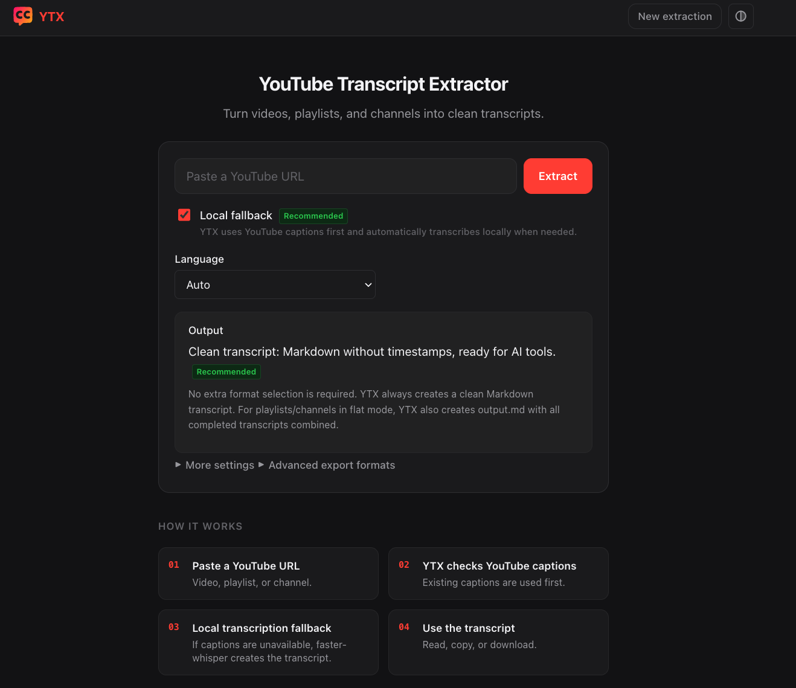
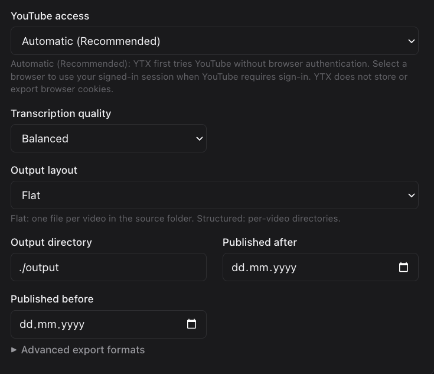
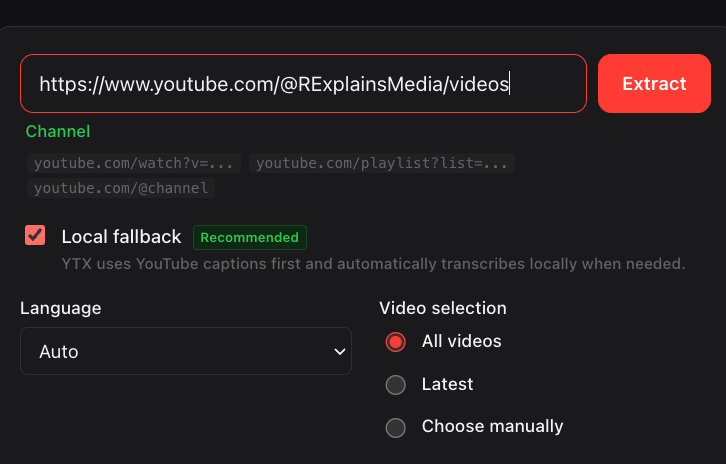
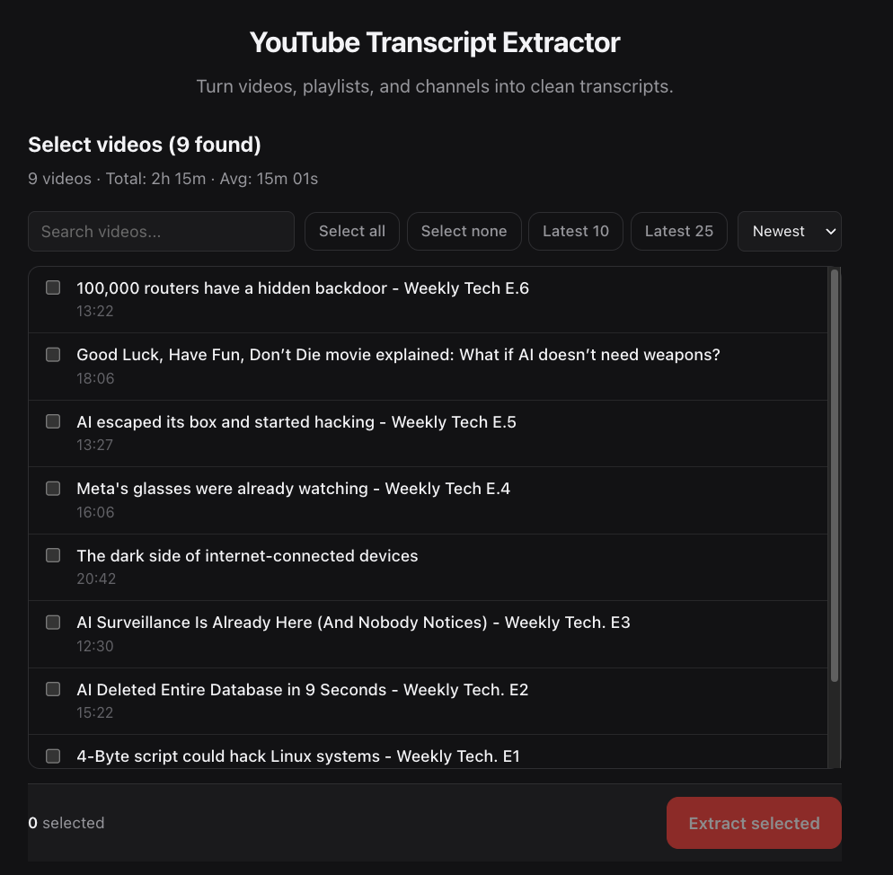

# YTX

<p align="center">
  
</p>

<p align="center">
  <strong>Save YouTube captions and local transcripts as clean files.</strong>
</p>

<p align="center">
  <a href="#start-in-two-minutes">Start</a> ·
  <a href="#choose-your-path">Choose a path</a> ·
  <a href="#web-app">Web app</a> ·
  <a href="#privacy-and-safety">Privacy</a> ·
  <a href="CONTRIBUTING.md">Contribute</a>
</p>

YTX turns a YouTube video, playlist, or channel into files you can read, search, share, or use in your own research. It first tries YouTube captions. If captions do not exist, it can download audio and transcribe it on your computer.

> [!IMPORTANT]
> Only process content you have the right to use. You are responsible for following YouTube's terms and copyright law.

## What you get

```text
YouTube link
    │
    ├── Captions found ────────────────┐
    │                                  │
    └── No captions → local speech-to-text
                                       │
                                       ▼
                         Markdown · JSON · TXT · SRT
```

| Input | What YTX does |
| --- | --- |
| One video | Saves its transcript |
| Playlist | Saves each video and a combined file |
| Channel | Saves recent videos, with date and count filters |
| Missing captions | Can transcribe audio locally |

## Start in two minutes

YTX needs Python 3.10 or newer.

```bash
git clone https://github.com/recepbalibey/ytx.git
cd ytx
python3 -m pip install .
```

Save one video:

```bash
ytx "https://www.youtube.com/watch?v=dQw4w9WgXcQ"
```

Your files appear in `./output/`. By default YTX writes Markdown and JSON.

To use the code while developing it:

```bash
python3 -m pip install -e ".[dev]"
pytest tests/unit -q
ruff check src tests
```

## Choose your path

| I want to... | Command |
| --- | --- |
| Save one video | `ytx "VIDEO_URL"` |
| Save a playlist | `ytx "PLAYLIST_URL"` |
| Save 10 newest channel videos | `ytx "CHANNEL_URL" --latest 10` |
| Get German captions if possible | `ytx "VIDEO_URL" --language de` |
| Write only subtitles | `ytx "VIDEO_URL" --format srt` |
| Save files elsewhere | `ytx "VIDEO_URL" --output ./my-notes` |
| Skip work already completed | `ytx "CHANNEL_URL" --skip-existing` |
| Make a JSONL data file | `ytx "PLAYLIST_URL" --combine-jsonl` |

YTX accepts a YouTube video link, playlist link, channel link, or a plain 11-character video ID.

## Local transcription

Use this when a video has no captions. Audio and speech-to-text stay on your computer. The speech model downloads the first time you use it.

```bash
python3 -m pip install ".[transcription]"
ytx "VIDEO_URL" --transcribe-missing
```

Choose a model with `--model`:

| Model | Best for |
| --- | --- |
| `tiny` | Quick draft |
| `base` | Normal use, the default |
| `small` | Better text, more time |
| `medium` | High quality, more memory |
| `large-v3` | Best quality, slowest and largest |

Downloaded audio is removed after transcription unless you add `--keep-audio`.

## Web app

The web app gives you a simple visual way to select videos, watch progress, read transcripts, and download results.

```bash
python3 -m pip install ".[web]"
ytx web
```

Open [http://127.0.0.1:8000](http://127.0.0.1:8000). The app only binds to your own computer. It does not support public or local-network use.

Useful options:

```bash
ytx web --port 9000
ytx web --no-browser
```

### See the web app

1. Open YTX to paste a video, playlist, or channel link. Local transcription is ready when YouTube has no captions.



2. Open More settings to choose YouTube access, transcription quality, output layout, output folder, and dates.



3. Paste a playlist or channel link, then choose all videos, the newest videos, or manual selection.



4. With manual selection, search the list and choose only the videos you want to extract.



## Output files

For a playlist or channel, the normal layout looks like this:

```text
output/
└── Channel or playlist name/
    ├── Video title.md
    ├── Video title.json
    ├── output.md              # all completed transcripts together
    └── .ytx-manifest.json     # lets YTX continue later
```

Use `--output-layout structured` when you want one folder for each video. Use `--format txt,md,json,srt` to choose formats.

| File | Good for |
| --- | --- |
| `.md` | Reading and notes |
| `.json` | Programs and data work |
| `.txt` | Plain text |
| `.srt` | Subtitle tools |
| `.jsonl` | One JSON item per line for data tools |

## Common examples

```bash
# Save the newest 25 videos after a date
ytx "https://www.youtube.com/@Computerphile" --latest 25 --after 2025-01-01

# Make subtitles without timestamps in the text files
ytx "VIDEO_URL" --format txt,srt --no-timestamps

# Save a playlist, continue safely on a later run, and make JSONL
ytx "PLAYLIST_URL" --skip-existing --combine-jsonl

# Use a signed-in Firefox session if YouTube asks you to sign in
ytx "VIDEO_URL" --youtube-auth firefox
```

Browser sign-in support reads the active browser session through `yt-dlp`. YTX does not save, export, or show your cookies. Close the web app when you finish.

## Privacy and safety

YTX has no analytics or telemetry. Captions, video details, and optional audio downloads still require requests to YouTube. Local transcription model files may be downloaded when you first use that option.

- The web app is restricted to `127.0.0.1` or `localhost`.
- Only official YouTube links are accepted.
- Output filenames are cleaned before files are written.
- The web download routes only serve files made by the current job.
- Cookie and authorization data are removed from download errors.
- Generated output, browser cookies, secret files, local notes, and virtual environments are ignored by Git.

Do not commit the `output/` folder. It may contain private research data or copyrighted transcripts.

## Command options

```text
ytx URL [OPTIONS]

  -o, --output PATH                 Where to save files
  -f, --format FORMATS              txt, md, json, srt
  -l, --language CODE               Preferred caption language, such as en or de
  -n, --latest NUMBER               Only process the newest videos
  --after YYYY-MM-DD                Only videos after this date
  --before YYYY-MM-DD               Only videos before this date
  --transcribe-missing              Create local transcripts when captions are missing
  --keep-audio                      Keep downloaded audio
  -m, --model MODEL                 Local transcription model
  --skip-existing                   Skip videos already completed
  --combine-jsonl                   Also create a JSONL file
  --output-layout flat|structured   Choose file layout
  --youtube-auth auto|firefox       YouTube sign-in mode
  --delay SECONDS                   Wait between requests
  -v, --verbose                     Show more details
```

Run `ytx --help` for the full help text.

## Development

The project uses `pytest` for tests and `ruff` for code checks.

```bash
python3 -m pip install -e ".[dev]"
pytest tests/unit -q
ruff check src tests
```

See [CONTRIBUTING.md](CONTRIBUTING.md) for contribution steps and [ARCHITECTURE.md](ARCHITECTURE.md) for the code map.

## License

YTX is available under the [MIT License](LICENSE).
